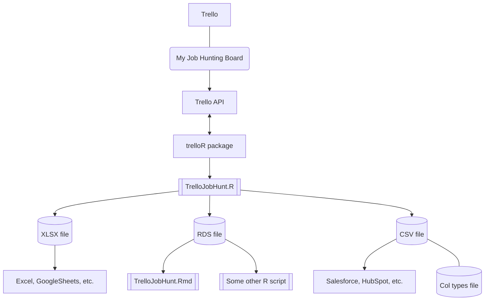
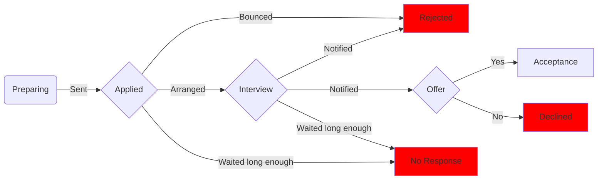

# trello-dump

This **TrelloJobHunt.R** script demonstrates using the [**trelloR**](https://github.com/jchrom/trelloR) package to get useful information out of a Trello board and then collect it together in a table-like format. In this case, it's a board I use for job hunting. The script creates two files:

-   An Excel XLSX file that can be used as a convenient activity overview or for further graphic or data processing 
-   An RDS file (an R-specific format) that can be used for further processing in R. In this project, I use **TrelloJobHunt.Rmd** for this
-   A CSV file that can be imported into an application that uses CSV for importing (like Salesforce or HubSpot) 

## Data collected from Trello entry

Here's how I use some of the Trello features for job hunting and how they are mapped by the script.

-   Each Trello card represents a single job opportunity with a unique *Trello card ID*

-   The Trello **title** is parsed as (*company*) *job* into these separate fields

- Each card can be in one of these Trello **lists** to represent its *status* in the job-hunt pipeline:

  -   Preparing

  -   Applied

  -   Interview

  -   Rejected

  -   No Response

  -   Offer

  -   Acceptance

  -   Declined

-   The Trello **label** is used to represent the *work model* for the job:

    -   On-site

    -   Hybrid

    -   Remote

-   The Trello date is used to create a completed **due date** that represents the initial *application date*

-   The Trello **description** field is used to represent the following information as the first four lines:

    1.  Link: the job listing URL (usually on LinkedIn because it keeps expired listings)

    2.  Location:

    3.  Interview Date: next or last interview

    4.  Rejected Date: for explicit rejections not no responses

    *Location*, *interview date*, and *rejected* date all appear as fields

-   The remaining lines in the Trello **description** field are saved as an *other notes* field

-   The Trello **card ID** is used to reconstruct the *created date* for the card

## Additional generated fields

The script also calculates some additional fields/columns for the spreadsheet:

-   An applied week field based on the applied date

-   A link to the card in Trello based on a Trello-generated URL for the card

-   A link to the job based on the URL derived from the first line of the description field

-   A link to a search for the company
